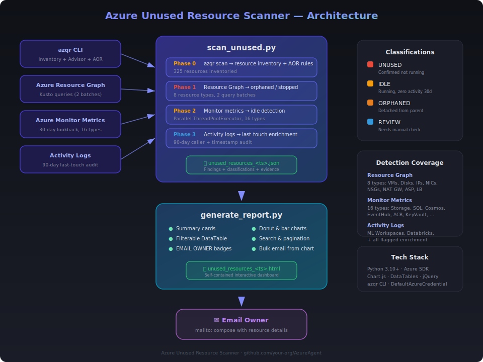

# Azure Unused Resource Scanner

> Automatically discover unused, idle, and orphaned resources across your Azure subscription — then visualize findings in an interactive dashboard and email resource owners to take action.

  

---

## Overview

Azure subscriptions accumulate unused resources over time — deallocated VMs, unattached disks, orphaned NICs, idle databases, and more. These forgotten resources silently increase your monthly Azure bill.

**Azure Unused Resource Scanner** solves this by running a multi-phase detection pipeline:

| Phase | Method | What It Detects |
|-------|--------|-----------------|
| **Phase 0** | `azqr` CLI scan | Full resource inventory, Azure Advisor cost items, Azure Orphan Resources (AOR) rules |
| **Phase 1** | Azure Resource Graph | Deallocated VMs, unattached disks, orphaned NICs, unassociated public IPs/NSGs, empty App Service Plans & Load Balancers |
| **Phase 2** | Azure Monitor metrics (30-day) | Zero-transaction storage accounts, idle databases, unused Cognitive Services, quiet Event Hubs, and 16 resource types total |
| **Phase 3** | Activity logs (90-day) | Last-touch timestamp and caller for ML workspaces, Databricks, and all flagged resources |

### Resource Classifications

Each finding is classified based on evidence:

| Classification | Meaning | Example |
|---------------|---------|---------|
| **UNUSED** | Confirmed not running | VM deallocated for 60+ days |
| **IDLE** | Running but zero activity | Storage account with 0 transactions in 30 days |
| **ORPHANED** | Detached from parent resource | NIC not attached to any VM |
| **REVIEW** | Cannot determine programmatically | ML workspace with no recent activity log entries |

---

## Architecture

<p align="center">
  
</p>

---

## Prerequisites

| Requirement | Install |
|-------------|---------|
| **Python 3.10+** | [python.org](https://www.python.org/downloads/) |
| **Azure CLI** | [Install Azure CLI](https://learn.microsoft.com/cli/azure/install-azure-cli) |
| **azqr CLI** (optional but recommended) | [github.com/Azure/azqr](https://github.com/Azure/azqr) |
| **Azure permissions** | Reader role on the target subscription |

---

## Quick Start

### 1. Clone the repo

```bash
git clone https://github.com/<your-org>/AzureAgent.git
cd AzureAgent
```

### 2. Install Python dependencies

```bash
pip install -r requirements.txt
```

This installs:
- `azure-identity` — Azure authentication (DefaultAzureCredential)
- `azure-mgmt-resourcegraph` — Resource Graph queries
- `azure-mgmt-monitor` — Metrics and activity log access
- `azure-mgmt-resource` — Resource management client

### 3. Authenticate to Azure

```bash
az login
az account set --subscription "<your-subscription-id>"
```

### 4. Run the scan

```bash
python scan_unused.py --subscription-id "<your-subscription-id>"
```

This produces a JSON file: `unused_resources_<timestamp>.json`

### 5. Generate the visual report

```bash
python generate_report.py unused_resources_<timestamp>.json
```

This produces a self-contained HTML file: `unused_resources_<timestamp>.html`

### 6. Email subscription owners

1. Open the HTML report in your browser
2. Enter the resource owner's email address in the **Owner Email** input box
3. **Per-resource:** Click any **EMAIL OWNER** badge in the table to compose an email for that specific resource
4. **Bulk email:** Click the **EMAIL OWNER** segment in the *Recommended Actions* donut chart to compose a single email listing **all** flagged resources

---

## Scanner Options

```
python scan_unused.py --subscription-id <sub-id> [OPTIONS]

Options:
  --subscription-id   Azure subscription ID (required)
  --filters           Path to azqr filter YAML (default: filters.yaml)
  --azqr-file         Use an existing azqr JSON output instead of running a new scan
  --skip-azqr         Skip azqr entirely; use Resource Graph for inventory
  --output            Custom output file path (default: unused_resources_<timestamp>.json)
```

**Examples:**

```bash
# Full scan with azqr + all phases
python scan_unused.py --subscription-id "e4718866-4e88-411f-a0b8-10c8051dc165"

# Reuse an existing azqr scan file
python scan_unused.py --subscription-id "e4718866-4e88-411f-a0b8-10c8051dc165" \
    --azqr-file azqr_action_plan_2026_03_16_T084304.json

# Skip azqr, rely on Resource Graph for inventory
python scan_unused.py --subscription-id "e4718866-4e88-411f-a0b8-10c8051dc165" --skip-azqr

# Custom output path
python scan_unused.py --subscription-id "e4718866-4e88-411f-a0b8-10c8051dc165" --output my_report.json
```

---

## Report Generator Options

```
python generate_report.py <input-json> [OPTIONS]

Options:
  input               Path to unused_resources JSON file (required)
  --output            Custom output HTML file path (default: same name with .html extension)
```

---

## Interactive Dashboard Features

The generated HTML report is a fully self-contained, dark-themed dashboard.

**[View Sample Report](https://htmlpreview.github.io/?https://github.com/anildwarepo/AzureAgent/blob/main/docs/sample_report.html)**

- **Summary cards** — Total inventory, scanned, unused, idle, orphaned, needs review, skipped
- **Findings by Classification** — Donut chart (UNUSED, IDLE, ORPHANED, REVIEW)
- **Findings by Resource Type** — Horizontal bar chart
- **Findings by Resource Group** — Horizontal bar chart
- **Recommended Actions** — Clickable donut chart; click EMAIL OWNER to bulk-email all items
- **Filterable data table** — Filter by classification, search across all columns, sortable, paginated
- **EMAIL OWNER badges** — Click to compose a mailto: with resource details pre-filled

---

## Email Workflow

The report supports two email workflows — no SMTP server or API keys required:

### Per-Resource Email
1. Enter the owner's email in the input box at the top of the table
2. Click any **EMAIL OWNER** badge on a table row
3. Your default email client opens with a pre-composed message containing:
   - Resource name, type, resource group
   - Status and reason for flagging
   - Scan date

### Bulk Email (All Flagged Resources)
1. Enter the owner's email in the input box
2. Click the **EMAIL OWNER** segment in the Recommended Actions donut chart
3. A single email is composed with a numbered list of every EMAIL OWNER resource

---

## Detection Coverage

### Phase 1 — Resource Graph (instant, property-based)

| Resource Type | Detection Rule |
|---------------|---------------|
| Virtual Machines | `powerState != 'running'` (deallocated/stopped) |
| Managed Disks | `managedBy` is empty (unattached) |
| Public IP Addresses | `ipConfiguration` is empty (unassociated) |
| Network Interfaces | `virtualMachine` is empty (orphaned) |
| Network Security Groups | No attached NICs or subnets |
| NAT Gateways | No attached subnets |
| App Service Plans | `numberOfSites == 0` (empty) |
| Load Balancers | No backend pools |

### Phase 2 — Monitor Metrics (30-day lookback, parallel)

| Resource Type | Metric(s) Checked |
|---------------|-------------------|
| Storage Accounts | Transactions |
| SQL Databases | cpu_percent, dtu_consumption_percent |
| PostgreSQL Flexible Servers | active_connections, cpu_percent |
| Cosmos DB | TotalRequests |
| Event Hubs | IncomingMessages, OutgoingMessages |
| Service Bus | IncomingMessages, OutgoingMessages |
| Cognitive Services | TotalCalls |
| Container Registries | TotalPullCount, TotalPushCount |
| Key Vaults | ServiceApiHit |
| Application Insights | requestsCount |
| API Management | TotalRequests |
| Data Factory | PipelineSucceededRuns, PipelineFailedRuns |
| Azure Search | SearchQueriesPerSecond |
| Kusto (Data Explorer) | QueryCount, IngestionResult |
| Container Apps | Requests |
| VPN Gateways | TunnelIngressBytes, TunnelEgressBytes |

### Phase 3 — Activity Logs (90-day lookback)

| Resource Type | What It Checks |
|---------------|---------------|
| ML Workspaces | Management operations in activity log |
| Databricks Workspaces | Management operations in activity log |
| All flagged resources | Last caller + timestamp enrichment |

---

## Filters Configuration

The `filters.yaml` file controls which azqr sections are included/excluded:

```yaml
includeSections:
  - Costs
  - Advisor
  - Inventory
  - Orphaned
excludeSections:
  - Recommendations
  - AzurePolicy
  - DefenderRecommendations
```

---

## Output Schema

The scanner produces a JSON file with this structure:

```json
{
  "scanDate": "2026-03-16T20:19:26+00:00",
  "subscriptionId": "e4718866-...",
  "azqrFile": "azqr_action_plan_2026_03_16_T084304.json",
  "summary": {
    "totalInventory": 325,
    "scanned": 187,
    "unused": 2,
    "idle": 0,
    "orphaned": 19,
    "review": 12,
    "skipped": 138
  },
  "findings": [
    {
      "resourceId": "/subscriptions/.../virtualMachines/linuxdevvm",
      "resourceName": "linuxdevvm",
      "resourceType": "microsoft.compute/virtualmachines",
      "resourceGroup": "vm",
      "classification": "UNUSED",
      "reason": "VM deallocated",
      "recommendation": "DELETE",
      "evidence": {
        "source": "phase1-property",
        "lastActivity": "2026-01-15T22:42:32+00:00"
      }
    }
  ]
}
```

---

## Files

| File | Description |
|------|-------------|
| `scan_unused.py` | Multi-phase unused resource scanner (Python) |
| `generate_report.py` | Interactive HTML dashboard generator |
| `requirements.txt` | Python dependencies |
| `filters.yaml` | azqr scan filter configuration |
| `unused-resource-scanner.instructions.md` | Copilot agent instructions for automated scanning |

---

## Copilot Agent Integration

This repo includes `unused-resource-scanner.instructions.md` — agent instructions for GitHub Copilot that enable it to run the full scan workflow as an AI agent. The instructions cover:

- Running azqr scans with proper filters
- Resource-to-strategy mapping for 35+ Azure resource types
- Classification rules and thresholds
- Report generation and interpretation

---

## License

MIT
