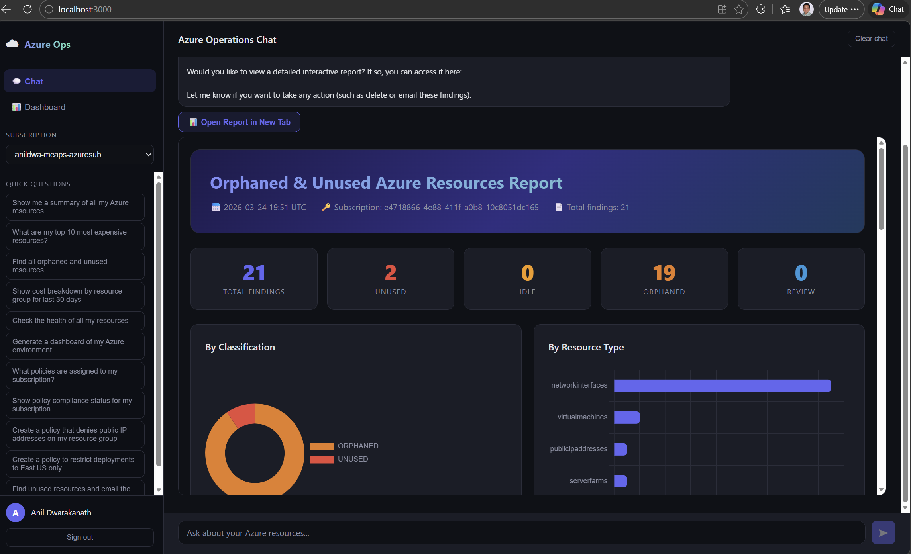
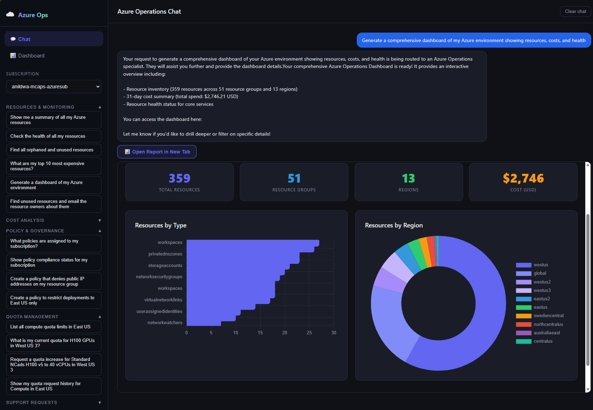
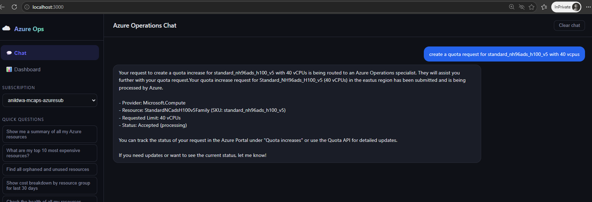
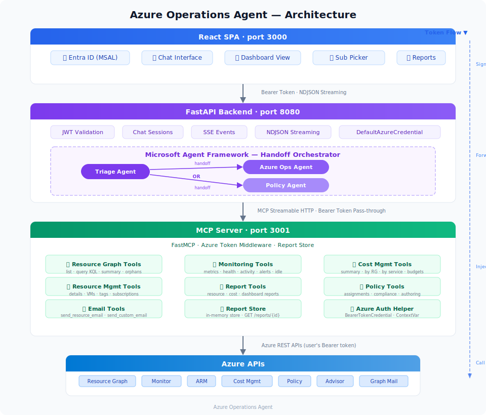

# Azure Operations Agent

An interactive AI-powered agent for monitoring, managing, and analyzing Azure resources through a chat interface and visual dashboards. Built with **Microsoft Agent Framework**, **MCP (Model Context Protocol)**, **FastAPI**, and **React**.

---

## Table of Contents

- [Overview](#overview)
- [Features](#features)
- [Architecture](#architecture)
- [Component Overview](#component-overview)
- [Prerequisites](#prerequisites)
- [Azure Setup](#azure-setup)
  - [1. Entra ID App Registration](#1-entra-id-app-registration)
  - [2. Azure OpenAI Deployment](#2-azure-openai-deployment)
  - [3. Azure RBAC Permissions](#3-azure-rbac-permissions)
- [Configuration](#configuration)
  - [Backend API (.env)](#backend-api-env)
  - [React SPA (authConfig.js)](#react-spa-authconfigjs)
- [Installation & Running](#installation--running)
  - [Quick Start (All Services)](#quick-start-all-services)
  - [Manual Start (Individual Services)](#manual-start-individual-services)
- [Verifying the Setup](#verifying-the-setup)
- [Usage Guide](#usage-guide)
  - [Chat Interface](#chat-interface)
  - [Dashboard View](#dashboard-view)
  - [Example Questions](#example-questions)
- [API Reference](#api-reference)
- [Docker Deployment](#docker-deployment)
- [Project Structure](#project-structure)
- [Troubleshooting](#troubleshooting)

---

## Overview

The Azure Operations Agent lets you interact with your Azure environment using natural language. Ask questions about your resources, costs, health, and compliance — the agent queries Azure APIs in real time and returns answers with rich visual reports.



**Key capabilities:**

| Capability | Description |
|---|---|
| **Resource Discovery** | List and search Azure resources using Resource Graph (KQL) |
| **Monitoring** | Query metrics, check resource health, review activity logs, detect idle resources |
| **Cost Analysis** | Cost summaries, breakdowns by resource group/service/resource, budgets, Advisor recommendations |
| **Resource Management** | VM operations (start/stop/restart/deallocate), tag management, subscription listing |
| **Azure Policy** | List policy assignments, check compliance, author custom policy definitions |
| **Quota Management** | List current quotas, request quota increases, track request status across Compute/Network/ML providers |
| **Support Requests** | Create, list, update support tickets; manage communications; discover services and problem classifications |
| **Reporting** | Generate interactive HTML dashboards, resource reports, and cost visualizations |
| **Email Notifications** | Send resource findings to subscription owners or specific recipients *(work in progress)* |
| **Image Support** | Attach or paste images in chat — forwarded to the agent for multi-modal analysis |

---

## Features

### Interactive Dashboard

Generate comprehensive dashboards showing resources, costs, and health status across your Azure environment with a single question.

<p align="center">
  
</p>

### Quota Management

View current quota limits, request increases, and track approval status for Compute (VM vCPUs/GPUs), Network, and Machine Learning resources across any region.

<p align="center">
  
</p>

### Multi-Agent Orchestration

The agent uses a **handoff orchestration** pattern with 6 specialist agents, each focused on a specific domain:

| Agent | Responsibility |
|---|---|
| **Triage Agent** | Analyzes user intent and routes to the correct specialist |
| **Azure Ops Agent** | Resource discovery, monitoring, cost analysis, reports, email |
| **Policy Agent** | Policy assignments, compliance checks, policy authoring |
| **Quota List Agent** | Discovers quota limits by provider and region |
| **Quota Request Agent** | Submits quota increase requests and tracks status |
| **Support Agent** | Creates/lists/updates support tickets and communications |

---

## Architecture

<p align="center">
  
</p>

**Token flow:** User signs in via Entra ID in the SPA → SPA acquires an Azure Management token → token is forwarded through the API layer to the MCP server → each MCP tool uses the token to call Azure APIs on behalf of the user.

---

## Component Overview

| Component | Directory | Port | Technology | Purpose |
|---|---|---|---|---|
| **React SPA** | `azure-agent-spa/` | 3000 | React 19, MSAL | User interface: chat, dashboards, auth |
| **FastAPI Backend** | `af_fastapi/` | 8080 | FastAPI, Agent Framework | API layer: JWT validation, agent orchestration, NDJSON streaming |
| **MCP Server** | `mcp_server/` | 3001 | FastMCP, Azure SDKs | Tool server: Azure API integrations |

---

## Prerequisites

| Requirement | Version | Install |
|---|---|---|
| **Python** | 3.12+ | [python.org](https://www.python.org/downloads/) |
| **uv** | Latest | `pip install uv` or [docs.astral.sh/uv](https://docs.astral.sh/uv/) |
| **Node.js** | 18+ | [nodejs.org](https://nodejs.org/) |
| **npm** | 9+ | Included with Node.js |
| **Azure CLI** | Latest | [Install Azure CLI](https://learn.microsoft.com/cli/azure/install-azure-cli) |
| **Git** | Latest | [git-scm.com](https://git-scm.com/) |

Verify installations:

```powershell
python --version    # Python 3.12+
uv --version        # uv 0.x.x
node --version      # v18+
npm --version       # 9+
az --version        # Azure CLI 2.x
```

---

## Azure Setup

### 1. Entra ID App Registration

You need an App Registration in Microsoft Entra ID to authenticate users and acquire Azure Management tokens.

1. Go to [Azure Portal → Microsoft Entra ID → App registrations](https://portal.azure.com/#view/Microsoft_AAD_IAM/ActiveDirectoryMenuBlade/~/RegisteredApps)
2. Click **New registration**
   - **Name:** `Azure Operations Agent`
   - **Supported account types:** Accounts in this organizational directory only (Single tenant)
   - **Redirect URI:** Select **Single-page application (SPA)** and set `http://localhost:3000`
3. After creation, note the following values:
   - **Application (client) ID** — needed for `AZURE_CLIENT_ID` and SPA `authConfig.js`
   - **Directory (tenant) ID** — needed for `AZURE_TENANT_ID` and SPA `authConfig.js`
4. Under **API permissions**, add:
   - **Azure Service Management** → `user_impersonation` (Delegated)
5. Click **Grant admin consent** for your organization

### 2. Azure OpenAI Deployment

The agent uses Azure OpenAI for its LLM. You need an Azure OpenAI (or Azure AI Foundry) resource with a deployed model.

1. Create an [Azure OpenAI resource](https://portal.azure.com/#create/Microsoft.CognitiveServicesOpenAI) or use [Azure AI Foundry](https://ai.azure.com)
2. Deploy a model (recommended: `gpt-4.1` or `gpt-4o`)
3. Note:
   - **Endpoint URL** (e.g., `https://your-resource.cognitiveservices.azure.com/` or `https://your-resource.openai.azure.com/`)
   - **Deployment name** (e.g., `gpt-4.1`)
   - **API key** (if not using managed identity)

**Authentication options for Azure OpenAI:**
- **Managed Identity / Azure CLI (recommended):** Login with `az login`. The backend uses `DefaultAzureCredential` automatically.
- **API Key:** Set `AZURE_OPENAI_API_KEY` in the `.env` file.

### 3. Azure RBAC Permissions

The signed-in user needs appropriate Azure RBAC roles on the subscriptions they want to manage:

| Role | Purpose |
|---|---|
| **Reader** | List resources, query Resource Graph, view metrics, view costs |
| **Contributor** | All Reader permissions + VM operations, tag management |
| **Cost Management Reader** | View cost and billing data |
| **Resource Policy Contributor** | List and manage Azure Policy assignments |

At minimum, **Reader** is required to use most features.

---

## Configuration

### Backend API (.env)

The FastAPI backend reads configuration from `af_fastapi/.env.azure_ops` (which is copied to `.env` at startup by `run.ps1`).

Create or edit `af_fastapi/.env.azure_ops`:

```env
# Azure OpenAI / AI Foundry
AZURE_AI_PROJECT_ENDPOINT=https://<your-ai-foundry-resource>.services.ai.azure.com/api/projects/<project-name>
AZURE_AI_MODEL_DEPLOYMENT_NAME=gpt-4.1
AZURE_OPENAI_CHAT_DEPLOYMENT_NAME=gpt-4.1
AZURE_OPENAI_RESPONSES_DEPLOYMENT_NAME=gpt-4.1
AZURE_OPENAI_ENDPOINT=https://<your-openai-resource>.cognitiveservices.azure.com/

# (Optional) API key — omit if using az login / managed identity
# AZURE_OPENAI_API_KEY=your-api-key-here

# Entra ID (must match your App Registration)
AZURE_TENANT_ID=<your-tenant-id>
AZURE_CLIENT_ID=<your-client-id>

# MCP Server endpoint
MCP_ENDPOINT=http://localhost:3001/mcp

# CORS origins (comma-separated)
ALLOWED_ORIGINS=http://localhost:3000,http://127.0.0.1:3000
```

A sample file is available at `af_fastapi/.env.sample`.

### React SPA (authConfig.js)

Edit `azure-agent-spa/src/authConfig.js` with your App Registration values:

```javascript
export const msalConfig = {
  auth: {
    clientId: "<your-client-id>",                                          // Application (client) ID
    authority: "https://login.microsoftonline.com/<your-tenant-id>",       // Directory (tenant) ID
    redirectUri: window.location.origin,
  },
  cache: {
    cacheLocation: "sessionStorage",
    storeAuthStateInCookie: false,
  },
};

export const azureManagementLoginRequest = {
  scopes: ["https://management.azure.com/user_impersonation"],
};
```

---

## Installation & Running

### Quick Start (All Services)

The included `run.ps1` script launches all three services in separate PowerShell windows:

```powershell
# 1. Clone the repo
git clone <repo-url>
cd AzureAgent

# 2. Login to Azure (for DefaultAzureCredential)
az login

# 3. Configure environment (see Configuration section above)
#    Edit af_fastapi/.env.azure_ops
#    Edit azure-agent-spa/src/authConfig.js

# 4. Launch all services
.\run.ps1
```

This starts:
- **MCP Server** on `http://localhost:3001`
- **FastAPI Backend** on `http://localhost:8080`
- **React SPA** on `http://localhost:3000`

Open `http://localhost:3000` in your browser and sign in with your Microsoft account.

### Manual Start (Individual Services)

If you prefer to start each service individually (useful for debugging):

#### 1. MCP Server (Terminal 1)

```powershell
cd mcp_server

# Install dependencies (first time only)
uv pip install -e .

# Start the server
uv run python azure_ops_mcp_server.py --port 3001
```

Verify: `http://localhost:3001/mcp` should be available.

#### 2. FastAPI Backend (Terminal 2)

```powershell
cd af_fastapi

# Copy env config
Copy-Item .env.azure_ops .env -Force

# Install dependencies (first time only)
uv pip install -e .

# Start the server
uv run uvicorn azure_ops_api:app --port 8080 --reload
```

Verify: `http://localhost:8080/health` should return `{"ok": true, ...}`.

#### 3. React SPA (Terminal 3)

```powershell
cd azure-agent-spa

# Install dependencies (first time only)
npm install

# Start the dev server
npm start
```

The React app opens automatically at `http://localhost:3000`.

---

## Verifying the Setup

After all three services are running:

| Check | URL / Command | Expected Result |
|---|---|---|
| MCP Server is running | `http://localhost:3001/mcp` | MCP endpoint responds |
| Backend is healthy | `http://localhost:8080/health` | `{"ok": true, "pod": "...", "rev": "v0.1"}` |
| SPA is running | `http://localhost:3000` | Login page appears |
| Auth works | Click "Sign in with Microsoft" | Redirects to Microsoft login |
| Token acquired | After login, no "consent required" banner | Chat interface is visible |
| End-to-end | Type "Show me a summary of all my Azure resources" | Agent returns resource summary |

---

## Usage Guide

### Chat Interface

The chat view is the primary interface. Type natural language questions about your Azure environment:

1. **Sign in** — Click "Sign in with Microsoft" on the login page
2. **Select subscription** — Use the dropdown in the sidebar (auto-populated from your accessible subscriptions)
3. **Ask questions** — Type in the chat box or click a Quick Question from the sidebar
4. **View reports** — When the agent generates a visual report, it appears embedded in the chat with an option to open in a new tab

### Dashboard View

Click **Dashboard** in the sidebar to view the most recently generated dashboard report. Ask the agent to "Generate a dashboard of my Azure environment" to create one.

### Example Questions

**Resource Discovery:**
- "Show me a summary of all my Azure resources"
- "List all VMs in my subscription"
- "Find all orphaned and unused resources"

**Cost Analysis:**
- "What are my top 10 most expensive resources?"
- "Show cost breakdown by resource group for last 30 days"
- "What Azure Advisor cost recommendations do I have?"

**Monitoring & Health:**
- "Check the health of all my resources"
- "Show me CPU metrics for my VMs"
- "Are there any idle resources wasting money?"

**Policy & Compliance:**
- "What policies are assigned to my subscription?"
- "Show policy compliance status"
- "Create a policy that denies public IP addresses"
- "Create a policy to restrict deployments to East US only"

**Quota Management:**
- "List all compute quota limits in East US"
- "What is my current quota for H100 GPUs in West US 3?"
- "Request a quota increase for Standard NCads H100 v5 to 40 vCPUs in West US 3"
- "Show my quota request history for Compute in East US"

**Support Requests:**
- "List my open support tickets"
- "Show available Azure support services"
- "Create a support ticket for a billing issue"
- "Show communications on my latest support ticket"

**Reporting & Email:**
- "Generate a dashboard of my Azure environment"
- "Generate a cost report for last month"
- "Find unused resources and email the resource owners"

---

## API Reference

The FastAPI backend exposes the following endpoints:

| Method | Endpoint | Description | Auth |
|---|---|---|---|
| `GET` | `/health` | Health check | None |
| `POST` | `/chat` | Send a chat message, stream NDJSON response | Bearer token |
| `POST` | `/chat/clear` | Clear chat history for current user | Bearer token |
| `GET` | `/events?sid={session_id}` | SSE event stream for real-time notifications | None |
| `GET` | `/subscriptions` | List accessible Azure subscriptions | Bearer token |

### Chat Request

```json
POST /chat
Authorization: Bearer <azure-management-token>
Content-Type: application/json

{
    "message": "What resources do I have?",
    "subscription_id": "00000000-0000-0000-0000-000000000000"
}
```

### Chat Response (NDJSON stream)

Each line is a JSON object:

```json
{"response_message": {"type": "AgentRunUpdateEvent", "delta": "Let me check..."}}
{"response_message": {"type": "AgentRunUpdateEvent", "delta": " your resources."}}
{"response_message": {"type": "done", "result": "Full response text", "report_id": "abc123def456"}}
```

The MCP Server also serves generated reports at:

| Method | Endpoint | Description |
|---|---|---|
| `GET` | `/reports/{report_id}` | Retrieve a generated HTML report |

---

## Docker Deployment

### MCP Server

```bash
cd mcp_server
docker build -t azure-ops-mcp-server .
docker run -p 3001:3001 azure-ops-mcp-server
```

### FastAPI Backend

```bash
cd af_fastapi
docker build -t azure-ops-api .
docker run -p 8080:8080 \
  -e AZURE_TENANT_ID=<tenant-id> \
  -e AZURE_CLIENT_ID=<client-id> \
  -e AZURE_OPENAI_ENDPOINT=<endpoint> \
  -e AZURE_OPENAI_API_KEY=<key> \
  -e MCP_ENDPOINT=http://mcp-server:3001/mcp \
  azure-ops-api
```

### React SPA

```bash
cd azure-agent-spa
npm run build
# Serve the build/ folder with any static file server (nginx, Azure Static Web Apps, etc.)
```

---

## Project Structure

```
AzureAgent/
├── run.ps1                         # Launch all 3 services locally
├── README.md                       # This file
│
├── azure-agent-spa/                # React SPA (UI Layer)
│   ├── package.json                # Dependencies (React 19, MSAL)
│   ├── public/
│   │   └── index.html              # HTML entry point
│   └── src/
│       ├── index.js                # App bootstrap, MSAL initialization
│       ├── App.js                  # Main app: chat, dashboard, auth flow
│       ├── App.css                 # Styling
│       └── authConfig.js           # Entra ID / MSAL configuration
│
├── af_fastapi/                     # FastAPI Backend (API Layer + Agent)
│   ├── pyproject.toml              # Python dependencies (uv)
│   ├── Dockerfile                  # Container build
│   ├── .env.azure_ops              # Environment config (template)
│   ├── .env.sample                 # Minimal env sample
│   ├── azure_ops_api.py            # FastAPI routes (/chat, /health, /events)
│   ├── azure_ops_auth.py           # Entra ID JWT validation
│   ├── azure_ops_orchestrator.py   # Handoff orchestrator (triage → ops/policy agents)
│   ├── azure_ops_agent.py          # Single-agent implementation (alternative)
│   ├── azure_ops_mcp_client.py     # MCP client for direct tool invocation
│   ├── azure_ops_sse_bus.py        # SSE session manager for real-time events
│   ├── test_azure_ops.http         # HTTP test requests (VS Code REST Client)
│   └── shared/
│       └── models.py               # Shared Pydantic models
│
├── mcp_server/                     # MCP Server (Tool Layer)
│   ├── pyproject.toml              # Python dependencies (uv)
│   ├── Dockerfile                  # Container build
│   ├── README.md                   # MCP server documentation
│   ├── azure_ops_mcp_server.py     # Server entry point, tool registration
│   ├── azure_auth.py               # Token middleware + BearerTokenCredential
│   ├── resource_graph_tools.py     # Azure Resource Graph queries
│   ├── monitoring_tools.py         # Azure Monitor metrics, health, alerts
│   ├── resource_tools.py           # ARM resource management, VMs, tags
│   ├── cost_tools.py               # Cost Management API queries
│   ├── policy_tools.py             # Azure Policy tools
│   ├── report_tools.py             # HTML report generation
│   ├── report_store.py             # In-memory report storage
│   └── email_tools.py              # Email notification tools
│
├── extra/                          # Standalone scanner & utilities
│   ├── scan_unused.py              # Azure unused resource scanner
│   ├── generate_report.py          # Report generator for scanner findings
│   └── README.md                   # Scanner documentation
│
├── docs/                           # Documentation & samples
│   └── sample_report.html          # Example generated report
│
└── sample_app_components/          # Reference implementations
    ├── af_fastapi/                 # Sample Agent Framework patterns
    ├── mcp_server/                 # Sample MCP server patterns
    └── webapp/                     # Sample web app patterns
```

---

## Troubleshooting

### Common Issues

**"Missing Authorization: Bearer token" when chatting**
- The SPA failed to acquire an Azure Management token. Check:
  - `clientId` and `authority` in `authConfig.js` match your App Registration
  - API permission `Azure Service Management → user_impersonation` is granted with admin consent
  - Try signing out and signing in again

**"Token validation failed" (401 from backend)**
- `AZURE_TENANT_ID` and `AZURE_CLIENT_ID` in `.env.azure_ops` must match the App Registration
- The backend validates the token issuer and audience — ensure the token is for `https://management.azure.com`

**"Agent execution failed" or no response**
- Check the FastAPI terminal for errors
- Verify `AZURE_OPENAI_ENDPOINT` and model deployment name are correct
- If using DefaultAzureCredential, ensure `az login` was completed successfully
- If using an API key, set `AZURE_OPENAI_API_KEY` in `.env.azure_ops`

**MCP Server connection refused**
- Ensure the MCP server is running on port 3001
- Check `MCP_ENDPOINT` in `.env.azure_ops` is set to `http://localhost:3001/mcp`

**CORS errors in the browser console**
- `ALLOWED_ORIGINS` in `.env.azure_ops` must include the SPA origin (default: `http://localhost:3000`)

**"Consent required" banner in the SPA**
- Click the "Grant consent" button in the banner
- Or grant admin consent in the Azure Portal under App Registration → API permissions

**Port already in use**
- `run.ps1` automatically stops processes on ports 3000, 3001, and 8080 before starting
- To manually stop: `Get-NetTCPConnection -LocalPort 3001 -State Listen | ForEach-Object { Stop-Process -Id $_.OwningProcess -Force }`

**Python dependency issues**
- The project uses `uv` for dependency management. If you encounter conflicts:
  ```powershell
  cd mcp_server
  uv pip install --system --prerelease=allow -r pyproject.toml
  ```
- Agent Framework requires `opentelemetry-semantic-conventions-ai>=0.4.1,<0.5.0`

### Logs

- **MCP Server logs:** Visible in the MCP Server terminal window (INFO level by default)
- **FastAPI Backend logs:** Visible in the FastAPI terminal (`uvicorn.error` logger)
- **React SPA:** Browser dev tools console (F12)

### Testing the Backend API

Use the included `af_fastapi/test_azure_ops.http` file with the [VS Code REST Client extension](https://marketplace.visualstudio.com/items?itemName=humao.rest-client):

```http
### Health check
GET http://localhost:8080/health

### Chat (replace {{azure_token}} with a real token)
POST http://localhost:8080/chat
Authorization: Bearer {{azure_token}}
Content-Type: application/json

{
    "message": "What resources do I have?",
    "subscription_id": "{{subscription_id}}"
}
```

---

## License

MIT
